# SwiftUI Cheat Sheet


### Table of Contents
- [SwiftUI Cheat Sheet](#swiftui-cheat-sheet)
    - [Table of Contents](#table-of-contents)
- [Resource](#resource)
- [UIKit equivalent in SwiftUI](#uikit-equivalent-in-swiftui)
- [View](#view)
    - [Text](#text)
    - [Label](#label)
    - [TextEditor](#texteditor)
    - [Image](#image)
    - [Shape](#shape)
    - [ProgressView](#progressview)
    - [Map](#map)
- [Layout](#layout)
    - [Background](#background)
    - [VStack](#vstack)
    - [HStack](#hstack)
    - [ZStack](#zstack)
    - [LazyVStack](#lazyvstack)
    - [LazyHStack](#lazyhstack)
    - [LazyVGrid](#lazyvgrid)
    - [LazyHGrid](#lazyhgrid)
- [Input](#input)
    - [Toggle](#toggle)
    - [Button](#button)
    - [TextField](#textfield)
    - [Slider](#slider)
    - [Date Picker](#date-picker)
    - [Picker](#picker)
    - [Stepper](#stepper)
    - [Tap](#tap)
    - [Gesture](#gesture)
    - [OnChange](#onChange)
- [List](#list)
- [Containers](#containers)
    - [NavigationView](#navigationview)
    - [TabView](#tabView)
    - [Group](#group)
- [Alerts and Action Sheets](#alerts-and-action-sheets)
- [Navigation](#navigation)
- [Work with UIKit](#work-with-uikit)
    - [Navigate to ViewController](#navigate-to-viewcontroller)
    - [Use UIKit and SwiftUI Views Together](#use-uikit-and-swiftui-views-together)

# Resource
- [SwiftUI Tutorials (Official)](https://developer.apple.com/tutorials/swiftui/creating-and-combining-views)
- [Introducing SwiftUI: Building Your First App (Official)](https://developer.apple.com/videos/play/wwdc2019/204/)
- [SwiftUI: Getting Started Raywenderlich](https://www.raywenderlich.com/3715234-swiftui-getting-started)
- [SwiftUI Essentials (Official)](https://developer.apple.com/videos/play/wwdc2019/216)
- [SwiftUI - How to setup a project](https://medium.com/@martinlasek/swiftui-getting-started-372389fff423)
- [About SwiftUI](https://github.com/Juanpe/About-SwiftUI)


# UIKit equivalent in SwiftUI
| UIKit | [SwiftUI](https://developer.apple.com/xcode/swiftui/) |
| ----------- | ----------- |
| UILabel | [Text](#text) & [Label](#label)|
| UIImageView | [Image](#image) |
| UITextField | [TextField](#textfield) |
| UITextView | [TextEditor](#texteditor) |
| UISwitch | [Toggle](#toggle) |
| UISlider | [Slider](#slider) |
| UIButton | [Button](#button) |
| UITableView | [List](#list) |
| UICollectionView | [LazyVGrid](#lazyvgrid) / [LazyHGrid](#lazyhgrid) |
| UINavigationController | [NavigationView](#navigationview) |
| UITabBarController | [TabView](#tabview) |
| UIAlertController with style .alert | [Alert](#alerts-and-action-sheets) |
| UIAlertController with style .actionSheet | [ActionSheet](#alerts-and-action-sheets) |
| UIStackView with horizontal axis| [HStack](#hstack) / [LazyHStack](#lazyhstack) |
| UIStackView with vertical axis| [VStack](#vstack) / [LazyVStack](#lazyvstack) |
| UISegmentedControl | [Picker](#picker) |
| UIStepper | [Stepper](#stepper) |
| UIDatePicker | [DatePicker](#date-picker) |
| NSAttributedString | No equivalent (use [Text](#text)) |
| MapKIT | [Map](#map) |
| UIProgressView | [ProgressView](#progressview) |


# View

### Text

To show a **text** in UI simply write:
``` swift
Text("Hello World")
```

<details><summary>Screenshot</summary>
<p>


</p>
</details>

To add style

``` swift
Text("Hello World")
    .font(.largeTitle)
    .foregroundColor(Color.green)
    .lineSpacing(50)
    .lineLimit(nil)
    .padding()
```

<details><summary>Screenshot</summary>
<p>

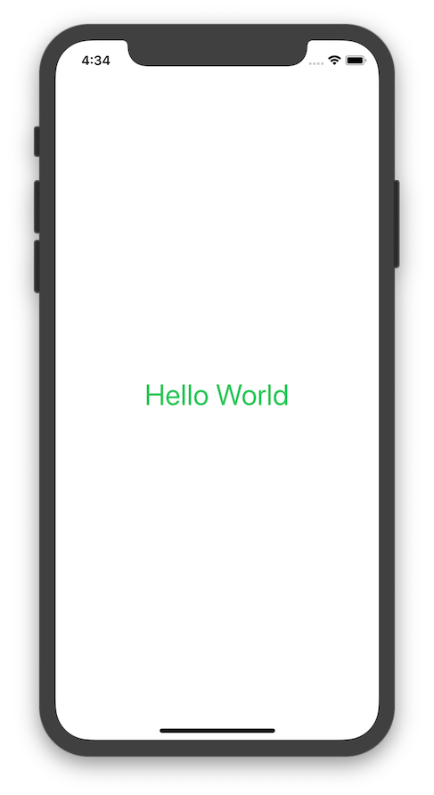

</p>
</details>

To format text inside text view

``` swift
static let dateFormatter: DateFormatter = {
    let formatter = DateFormatter()
    formatter.dateStyle = .long
    return formatter
}()

var now = Date()
var body: some View {
    Text("Task due date: \(now, formatter: Self.dateFormatter)")
}
```

<details><summary>Screenshot</summary>
<p>

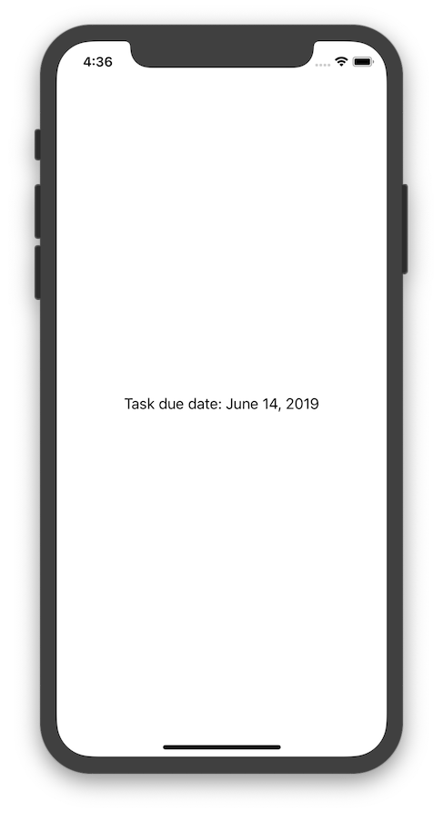

</p>
</details>

### Label
Labels are a much-needed addition in the latest SwiftUI iteration. They let you set icons alongside text with the following line of code.

``` swift
Label("SwiftUI CheatSheet 2.0", systemImage: "up.icloud")
```

It's possible to set URL, upon clicking which will redirect to browser.

``` swift
Link("Click me",destination: URL(string: "your_url")!)
```

### TextEditor
Multi-line scrollable UITextViews natively in SwiftUI

``` swift
TextEditor(text: $currentText)
                .onChange(of: clearText) { value in
                    if clearText{
                        currentText = ""
                    }
                }
```

### Map
MapKIT natively in SwiftUI

``` swift
Map(mapRect:interactionModes:showsUserLocation: userTrackingMode:
```

### Image
 To show image
 
``` swift
Image("hello_world") //image name is hello_world
```

<details><summary>Screenshot</summary>
<p>


</p>
</details>

To use system icon
``` swift
Image(systemName: "cloud.heavyrain.fill")
```

<details><summary>Screenshot</summary>
<p>


</p>
</details>

you can add style to system icon set

``` swift
Image(systemName: "cloud.heavyrain.fill")
    .foregroundColor(.red)
    .font(.largeTitle)
```

<details><summary>Screenshot</summary>
<p>

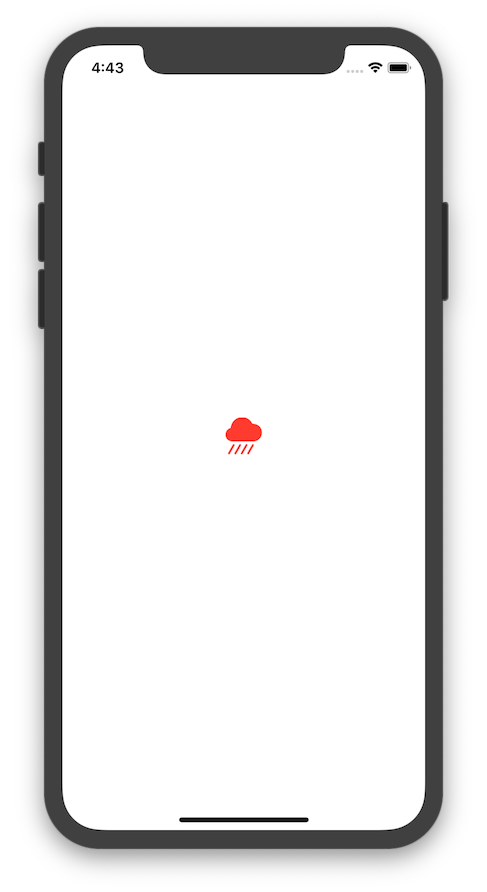

</p>
</details>

Add style to Image

``` swift
Image("hello_world")
    .resizable() //it will sized so that it fills all the available space
    .aspectRatio(contentMode: .fill)
    .padding(.bottom)
```

<details><summary>Screenshot</summary>
<p>


</p>
</details>

### Shape

To create Rectangle

``` swift
Rectangle()
    .fill(Color.red)
    .frame(width: 200, height: 200)
```

<details><summary>Screenshot</summary>
<p>


</p>
</details>

To create circle

``` swift
Circle()
    .fill(Color.blue)
    .frame(width: 50, height: 50)
```

<details><summary>Screenshot</summary>
<p>


</p>
</details>

### ProgressView

To create Rectangle
``` swift
ProgressView("Text", value: 10, total: 100)
```

# Layout

### Background
To use image as a background

``` swift
Text("Hello World")
    .font(.largeTitle)
    .background(
        Image("hello_world")
            .resizable()
            .frame(width: 100, height: 100)
    )
```

<details><summary>Screenshot</summary>
<p>

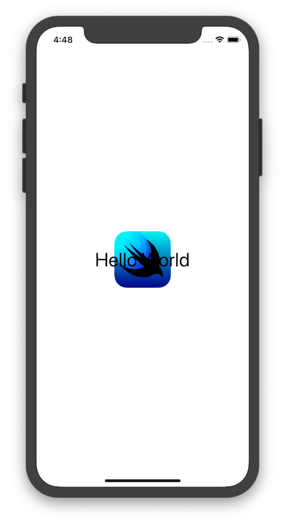

</p>
</details>

Gradient background

``` swift
Text("Hello World")
    .background(
        LinearGradient(
            gradient: Gradient(colors: [.white, .red, .black]), 
            startPoint: .leading, 
            endPoint: .trailing
        ),
        cornerRadius: 0
    )
```

<details><summary>Screenshot</summary>
<p>

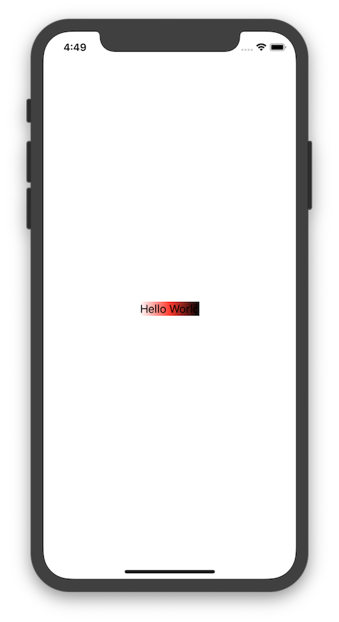

</p>
</details>

### VStack
Shows child view vertically

``` swift
VStack {
    Text("Hello")
    Text("World")
}
```

<details><summary>Screenshot</summary>
<p>


</p>
</details>

Styling

``` swift
VStack(alignment: .leading, spacing: 20) {
    Text("Hello")
    Divider()
    Text("World")
}
```

<details><summary>Screenshot</summary>
<p>

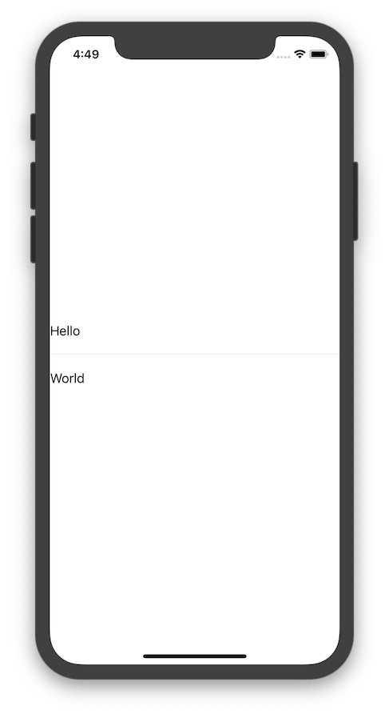

</p>
</details>

### HStack
Shows child view horizontally

``` swift
HStack {
    Text("Hello")
    Text("World")
}
```

<details><summary>Screenshot</summary>
<p>

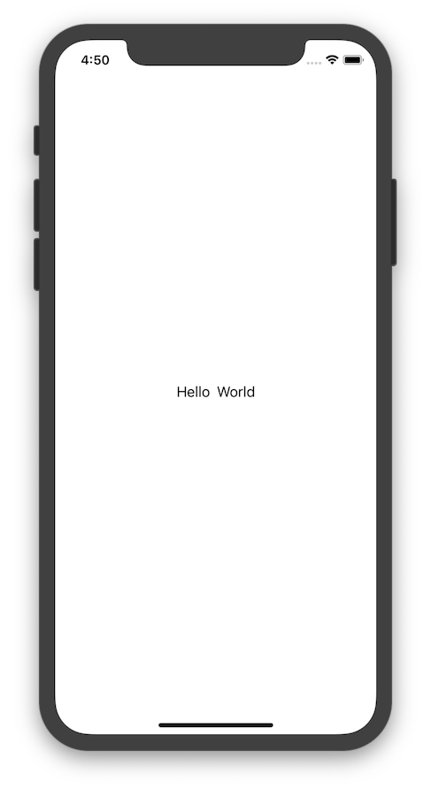

</p>
</details>

### ZStack

To create overlapping content use ZStack

``` swift
ZStack() {
    Image("hello_world")
    Text("Hello World")
        .font(.largeTitle)
        .background(Color.black)
        .foregroundColor(.white)
}
```

<details><summary>Screenshot</summary>
<p>


</p>
</details>

### LazyVStack

It loads content as and when it’s needed thus improving performance

``` swift
  ScrollView(.horizontal) {
           LazyVStack(spacing: 10) {
                ForEach(0..<1000) { index in
                    Text("\(index)")
                            .frame(width: 100, height: 200)
                            .border(Color.gray.opacity(0.5), width: 0.5)
                            .background(Color.blue)
                            .cornerRadius(6)
                }
            }
            .padding(.leading, 10)
        }
```

### LazyHStack

It loads content as and when it’s needed thus improving performance

``` swift
  ScrollView(.horizontal) {
            LazyHStack(spacing: 10) {
                ForEach(0..<1000) { index in
                    Text("\(index)")
                            .frame(width: 100, height: 200)
                            .border(Color.gray.opacity(0.5), width: 0.5)
                            .background(Color.blue)
                            .cornerRadius(6)
                }
            }
            .padding(.leading, 10)
        }
```

### LazyVGrid
A containers for grid-based layouts that let you set child views vertically in LazyVGrid. Each element of a SwiftUI grid is a GridItem. We can set the alignments, spacing, and size of the GridItem


``` swift
	struct ContentView: View {
    
    let colors: [Color] = [.red, .green, .yellow, .blue]
    
    var columns: [GridItem] =
        Array(repeating: .init(.flexible(), alignment: .center), count: 3)
    
    var body: some View {
        ScrollView {
            LazyVGrid(columns: columns, spacing: 10) {
                ForEach(0...100, id: \.self) { index in
                    Text("Tab \(index)")
                        .frame(width: 110, height: 200)
                        .background(colors[index % colors.count])
                    .cornerRadius(8)
                }
            }
        }
    }
}

```

### LazyHGrid
A containers for grid-based layouts that let you set child views horizontally in LazyHGrid


``` swift
	struct ContentView: View {
    
    let colors: [Color] = [.red, .green, .yellow, .blue]
    
    var columns: [GridItem] =
        Array(repeating: .init(.flexible(), alignment: .center), count: 3)
    
    var body: some View {
        ScrollView {
            LazyHGrid(columns: columns, spacing: 10) {
                ForEach(0...100, id: \.self) { index in
                    Text("Tab \(index)")
                        .frame(width: 110, height: 200)
                        .background(colors[index % colors.count])
                    .cornerRadius(8)
                }
            }
        }
    }
}

```

# Input

### Toggle

Toggle lets users move between true and false states

``` swift
@State var isShowing = true //state

Toggle(isOn: $isShowing) {
    Text("Hello World")
}.padding()
```

<details><summary>Screenshot</summary>
<p>

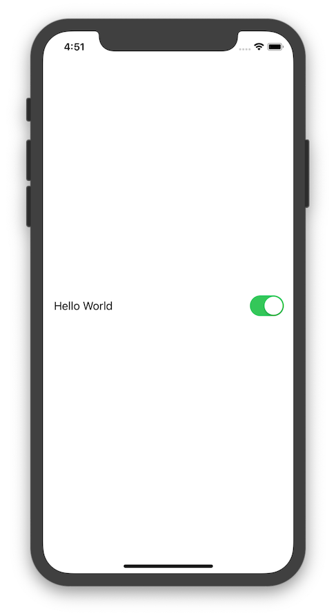

</p>
</details>

### Button
To create button

``` swift
Button(
    action: {
        // do something
    },
    label: { Text("Click Me") }
)
```

<details><summary>Screenshot</summary>
<p>


</p>
</details>

To create image Button

``` swift
Button(
    action: {
        // do something
    },
    label: { Image("hello_world") }
)
```


### TextField

It heavily relies in state, simply create a state and pass it as it will bind to it

``` swift
@State var fullName: String = "Joe" //create State

TextField($fullName) // passing it to bind
    .textFieldStyle(.roundedBorder) // adds border

```

<details><summary>Screenshot</summary>
<p>

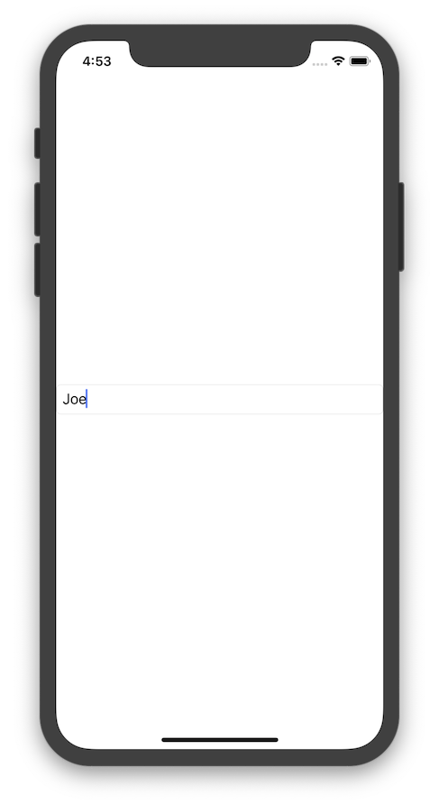

</p>
</details>

To create secure TextField

``` swift
@State var password: String = "" // create State

SecureField($password) // passing it to bind
    .textFieldStyle(.roundedBorder) // adds border

```

<details><summary>Screenshot</summary>
<p>


</p>
</details>

### Slider

``` swift
@State var value: Double = 0 // create State
    
Slider(value: $value, from: -100, through: 100, by: 1)
```

<details><summary>Screenshot</summary>
<p>

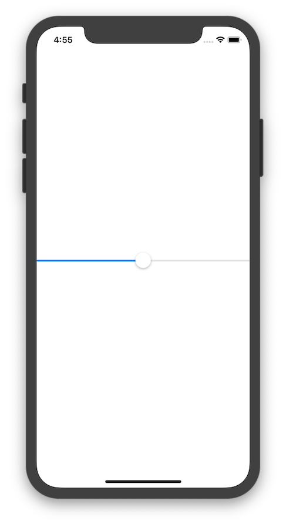

</p>
</details>

### Date Picker

``` swift
@State var selectedDate = Date()
DatePicker(
    $selectedDate,
    maximumDate: Date(),
    displayedComponents: .date
)
```

<details><summary>Screenshot</summary>
<p>

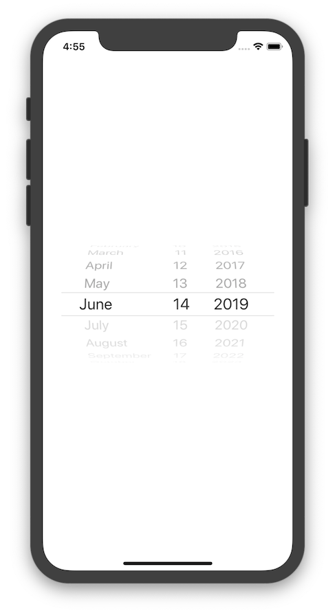

</p>
</details>

### Picker

``` swift
@State var favoriteColor = 0
var colors = ["Red", "Green", "Blue"]

Picker("Favorite Color", selection: $favoriteColor) {
    ForEach(0 ..< colors.count) { index in
        Text(self.colors[index])
            .tag(index)
    }
}
.pickerStyle(SegmentedPickerStyle())
```

<details><summary>Screenshot</summary>
<p>

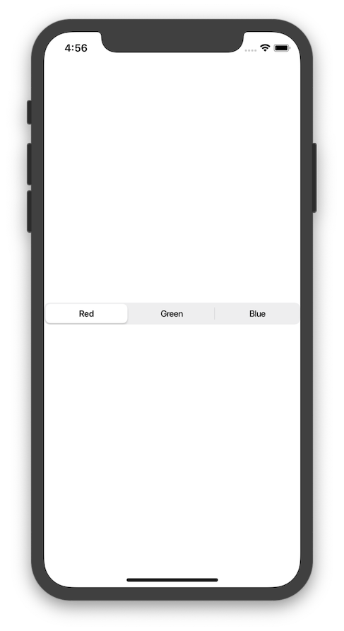

</p>
</details>

### Stepper

``` swift
@State var count:Int = 0

Stepper(
    onIncrement: { self.count += 1 }, 
    onDecrement: { self.count -= 1 }, 
    label: { Text("Count is \(count)") }
)
```

or

``` swift
@State var count:Int = 0

Stepper(value: $count, in: 1...10) {
    Text("Count is \(count)")
}
```
or

``` swift
@State private var temperature = 0.0

Stepper(value: $temperature, in: 0...100.0, step: 0.5) {
                Text("Temperature is \(temperature, specifier:"%g")")
            }
```

### Tap
For single tap

``` swift
Text("Tap me!")
    .onTapGesture {
        print("Tapped!")
    }
```
For double tap

``` swift
Text("Tap me!")
    .onTapGesture(count: 2) {
        print("Tapped!")
    }
```

<details><summary>Screenshot</summary>
<p>


</p>
</details>

### Gesture
 Gesture like **TapGesture**, **LongPressGesture**, **DragGesture**

``` swift
Text("Tap")
    .gesture(
        TapGesture()
            .onEnded { _ in
                // do something
            }
    )

Text("Drag Me")
    .gesture(
        DragGesture(minimumDistance: 50)
            .onEnded { _ in
                // do something
            }
    )

Text("Long Press")
    .gesture(
        LongPressGesture(minimumDuration: 2)
            .onEnded { _ in
                // do something
            }
    )
```

### OnChange

onChange is a new view modifier that’s available across all SwiftUI views. It lets you listen to state changes and perform actions on a view accordingly.

``` swift

 TextEditor(text: $currentText)
                .onChange(of: clearText) { value in
                    if clearText{
                        currentText = ""
                    }
                }

```

# List

To create static scrollable **List**

``` swift
List {
    Text("Hello world")
    Text("Hello world")
    Text("Hello world")
}
```

<details><summary>Screenshot</summary>
<p>

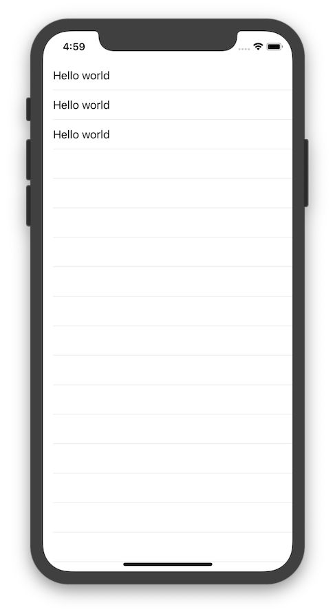

</p>
</details>

To create dynamic **List**
``` swift
let names = ["Thanos", "Iron man", "Ant man"]
List(names) { name in
    Text(name)
}
```

To add section

``` swift
List {
    Section(header: Text("Good Hero")) {
        Text("Thanos")
    }

    Section(header: Text("Bad Heros")) {
        Text("Iron man")
    }
}
```

<details><summary>Screenshot</summary>
<p>

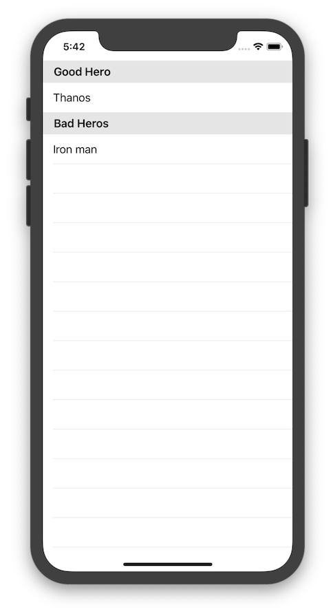

</p>
</details>

To make it grouped add *.listStyle(GroupedListStyle())*

``` swift
List {
    Section(header: Text("Good Hero")) {
        Text("Thanos")
    }

    Section(header: Text("Bad Heros")) {
        Text("Iron man")
    }
}.listStyle(GroupedListStyle())
```

<details><summary>Screenshot</summary>
<p>


</p>
</details>

To add a footer to a section

``` swift
List {
    Section(header: Text("Good Heros"), footer: Text("Powerful")){
        Text("Thanos")
    }
    Section(header: Text("Bad Heros"), footer: Text("Not as Powerful")){
        Text("Iron Man")
    }
}.listStyle(GroupedListStyle())
```

<details><summary>Screenshot</summary>
<p>


</p>
</details>

# Containers

### NavigationView

**NavigationView** is more/less like **UINavigationController**, It handles navigation between views, shows title, places navigation bar on top. 

``` swift
NavigationView {
    Text("Hello")
        .navigationBarTitle(Text("World"), displayMode: .inline)
}
```

<details><summary>Screenshot</summary>
<p>


</p>
</details>

For large title use *.large*

Add bar items to **NavigationView**

``` swift
NavigationView {
    Text("Hello")
        .navigationBarTitle(Text("World"), displayMode: .inline)
        .navigationBarItems(
            trailing:
                Button(
                    action: { print("Going to Setting") },
                    label: { Text("Setting") }
                )
        )
}
```

<details><summary>Screenshot</summary>
<p>

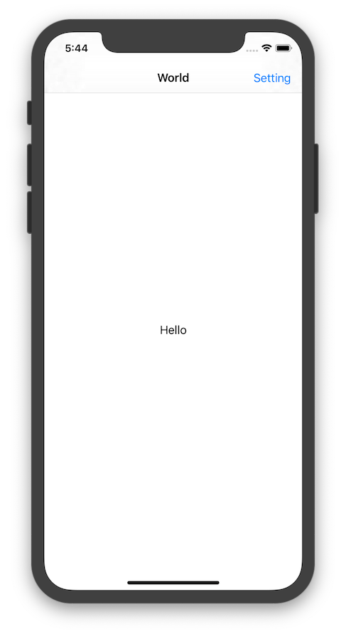

</p>
</details>

### TabView

**TabView** creates a container similar to **UITabBarController** with radio-style selection control which determines which `View` is presented.

``` swift
@State private var selection = 0

TabView(selection: $selection) {
    Text("View A")
        .font(.title)
        .tabItemLabel(Text("View A")
            .font(.caption))
        .tag(0)
    Text("View B")
        .font(.title)
        .tabItemLabel(Text("View B")
            .font(.caption))
        .tag(1)
    Text("View C")
        .font(.title)
        .tabItemLabel(Text("View C")
            .font(.caption))
        .tag(2)
}
```

<details><summary>Screenshot</summary>
<p>

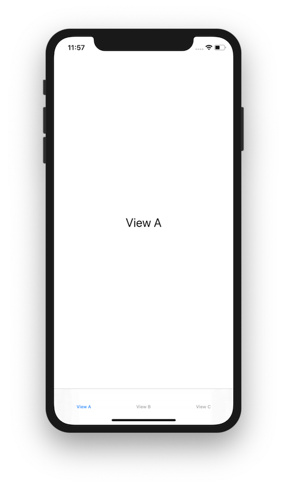

</p>
</details>

### Group
Group creates several views to act as one, also to avoid Stack's 10 View maximum limit.

``` swift
VStack {
    Group {
        Text("Hello")
        Text("Hello")
        Text("Hello")
    }
    Group {
        Text("Hello")
        Text("Hello")
    }
}
```

<details><summary>Screenshot</summary>
<p>


</p>
</details>

# Alerts and Action Sheets
To Show an Alert

``` swift
Alert(
    title: Text("Title"), 
    message: Text("message"), 
    dismissButton: .default(Text("Ok!"))
)

```
To Show Action Sheet

``` swift
ActionSheet(
    title: Text("Title"), 
    message: Text("Message"), 
    buttons: [
        .default(Text("Ok!"), action: { print("hello") })
    ]
)
```

# Navigation
Navigate via **NavigationLink**

``` swift
NavigationView {
    NavigationLink(destination: SecondView()) {
        Text("Show")
    }.navigationBarTitle(Text("First View"))
}
```

<details><summary>Screenshot</summary>
<p>

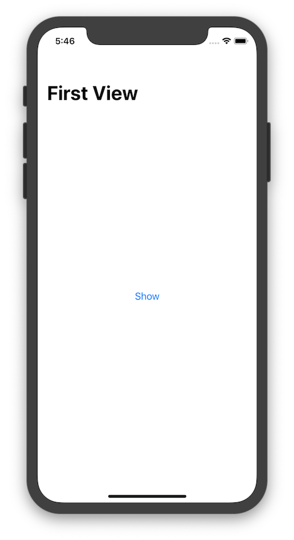

</p>
</details>

Navigate via tap on List Item

``` swift
let names = ["Thanos", "Iron man", "Ant man"]
List(names) { name in
    NavigationLink(destination: HeroView(name: name)) {
        Text(name)
    }
}
```

# Work with UIKit

### Navigate to ViewController

>  It's possible to work with UIKit components from SwiftUI or call SwiftUI views as View Controllers from UIKit. 

Let's say you have a View Controller named SuperVillainViewController and want to call it from a SwiftUI view, to do that ViewController needs to implement UIViewControllerRepresentable:

``` swift
struct SuperVillainViewController: UIViewControllerRepresentable {
    var controllers: [UIViewController]
    func makeUIViewcontroller(context: Context) -> SuperVillainViewController {
        // you could have a custom constructor here, I'm just keeping it simple
        let vc = SuperVillainViewController()
        return vc
    }
}
```
Now you can use it like 

``` swift
NavigationLink(destination: SuperVillainViewController()) {
    Text("Click")
}
```
### Use UIKit and SwiftUI Views Together

> To use UIView subclasses from within SwiftUI, you wrap the other view in a SwiftUI view that conforms to the UIViewRepresentable protocol. ([Reference](https://developer.apple.com/tutorials/swiftui/creating-and-combining-views#use-uikit-and-swiftui-views-together))

as example 

``` swift

import SwiftUI
import MapKit

struct MapView: UIViewRepresentable {
    func makeUIView(context: Context) -> MKMapView {
        MKMapView(frame: .zero)
    }

    func updateUIView(_ view: MKMapView, context: Context) {
        let coordinate = CLLocationCoordinate2D(
            latitude: 34.011286, 
            longitude: -116.166868
        )
        let span = MKCoordinateSpan(latitudeDelta: 2.0, longitudeDelta: 2.0)
        let region = MKCoordinateRegion(center: coordinate, span: span)
        view.setRegion(region, animated: true)
    }
}

struct MapView_Preview: PreviewProvider {
    static var previews: some View {
        MapView()
    }
}
```
